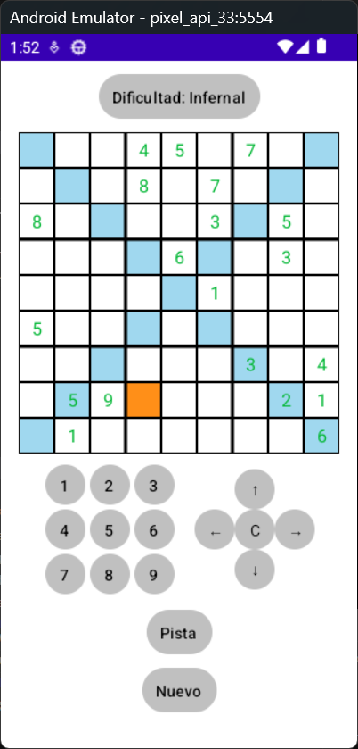

## Captura de Pantalla

# Sudoku - Características del Juego

Este es un juego de Sudoku funcional con las siguientes características:

## Diagonales

El juego incluye la opción de jugar con diagonales, lo que añade un desafío adicional. Las celdas en las diagonales principales también deben cumplir las reglas del Sudoku.

## Warnings (Advertencias)

El juego proporciona advertencias cuando se ingresan números incorrectos, ayudando al jugador a identificar errores.

## Pistas

El juego ofrece pistas para ayudar a los jugadores a resolver el rompecabezas.

## Niveles

El juego incluye diferentes niveles de dificultad para adaptarse a jugadores de todos los niveles de habilidad.

## Generación del APK para Android

Para generar el archivo APK para Android, sigue estos pasos:

### Dependencias

*   Android Studio (con SDK de Android instalado)
*   Java Development Kit (JDK)

### Procedimiento

1.  **Abre el proyecto en Android Studio:** Importa el proyecto en Android Studio.
2.  **Construye el APK:** Ve a "Build" -> "Build Bundle(s) / APK(s)" -> "Build APK(s)".
3.  **Localiza el APK:** El APK generado se encontrará en el directorio `app/build/outputs/apk/debug/` o `app/build/outputs/apk/release/`, dependiendo de la configuración de compilación.

### Instalación

Una vez que tengas el archivo APK, puedes instalarlo en tu dispositivo Android o emulador.
